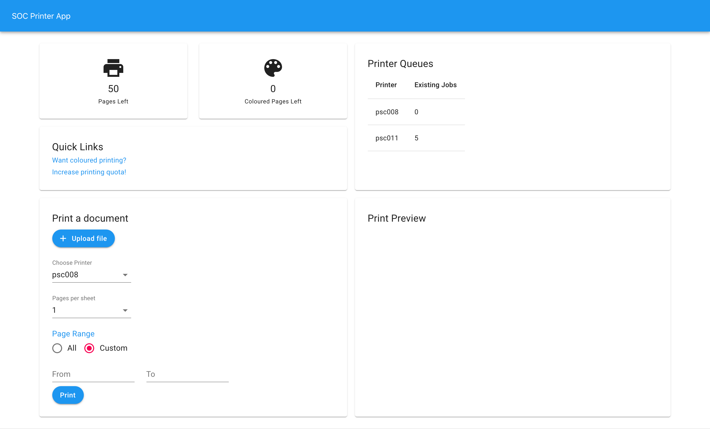

# soc-printer-desktop-app

A desktop app to help manage printing in the School of Computing, written in Electron and React.

## Tech Stack

The following libraries were used:

- Electron: to create a desktop app
- React: for managing views and screens
- Material UI: for frontend styling

Other tools used:

- [Create React App](https://github.com/facebook/create-react-app): to bootstrap the project
- ESLint and Prettier: for code formatting and linting

## Development

Clone this repository: `git clone https://github.com/cant-think-of-name/soc-printer-desktop-app.git`

Installing dependencies: `yarn`

Starting up the app: `yarn start`

Building for production: `yarn build`

Linting the project: `yarn lint`

Original scripts from `create-react-app` are prefixed with `react-`:

- `react-start`
- `react-build`
- `react-test`
- `react-eject`
